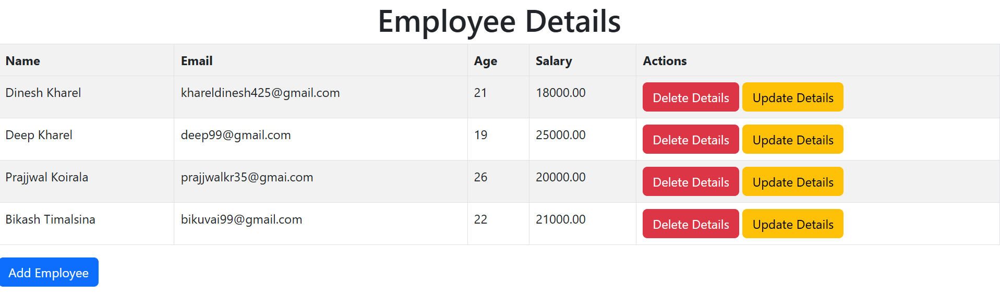
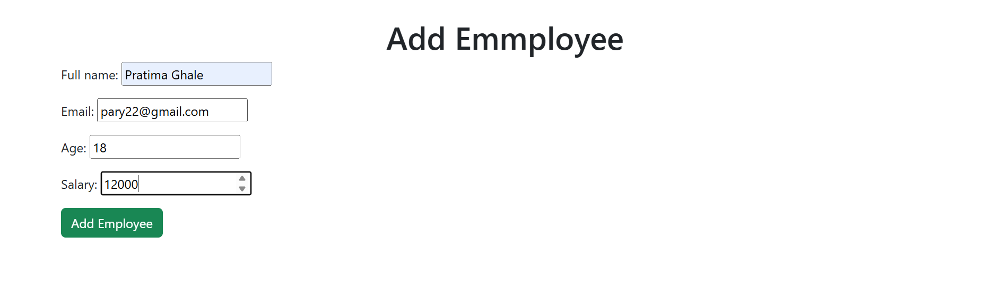
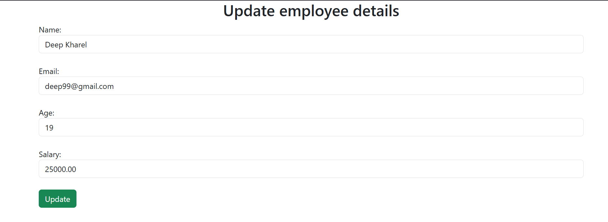

# Employee Management App (Django)

A simple Django CRUD (Create, Read, Update, Delete) application for managing employees. This app demonstrates basic Django concepts such as models, forms, views, templates, and URL routing.

---

##  Features

* List all employees
* Add a new employee
* Update existing employee details
* Delete an employee
* Uses Django ORM and Django Forms
* Simple function-based views

---

##  App Structure

```
EmployeeManagementSystem/
│── migrations/
│── templates/
│   └── employees/
│       ├── employee_list.html
│       ├── add_employee.html
│       └── update_employee.html
│── models.py
│── forms.py
│── views.py
│── urls.py
│── admin.py
```

---

##  Models

The `Employee` model typically contains fields like:

* `full_name`
* `email`
* `age`
* `salary`

``` python
from django.db import models


.
class Employee(models.Model):
    full_name = models.CharField(max_length=20)
    email = models.CharField(unique=True)
    age = models.IntegerField()
    salary = models.DecimalField(max_digits=10, decimal_places=2)


def __str__(self):
    return self.full_name

```

---

##  Forms

The `EmployeeForm` is a Django `ModelForm` used to:

* Validate employee input
* Create new employee records

forms.py

```python
from .models import Employee
from django import forms

class EmployeeForm(forms.ModelForm):
    class Meta:
        model = Employee
        fields= '__all__'
```

---

##  Views Overview

### 1. Employee List

Displays all employees.

```python
Employee.objects.all()
```



### 2. Add Employee

* Uses `EmployeeForm`
* Handles GET and POST requests
* Redirects to employee list after successful save




### 3. Update Employee

* Fetches employee by `id`
* Updates fields manually from POST data
* Saves changes and redirects


### 4. Delete Employee

* Deletes employee by `id`
* Redirects to employee list

---

##  URL Configuration 

```python
from django.urls import path 
from . import views

urlpatterns=[ 
    path('',views.employee_list, name= 'employee_list'),
    path('add_employee/',views.add_employee, name='add_employee'),
    path('update/<int:id>/',views.update_employee, name='update_employee'),
    path('delete/<int:id>/',views.delete_employee, name='delete_employee')
]
```

---

##  How to Run the Project

1. Clone the repository
2. Create and activate a virtual environment
3. Install dependencies:

```bash
pip install django
```

4. Apply migrations:

```bash
python manage.py makemigrations
python manage.py migrate
```

5. Run the development server:

```bash
python manage.py runserver
```

6. Open browser and visit:

```
http://127.0.0.1:8000/
```

---

