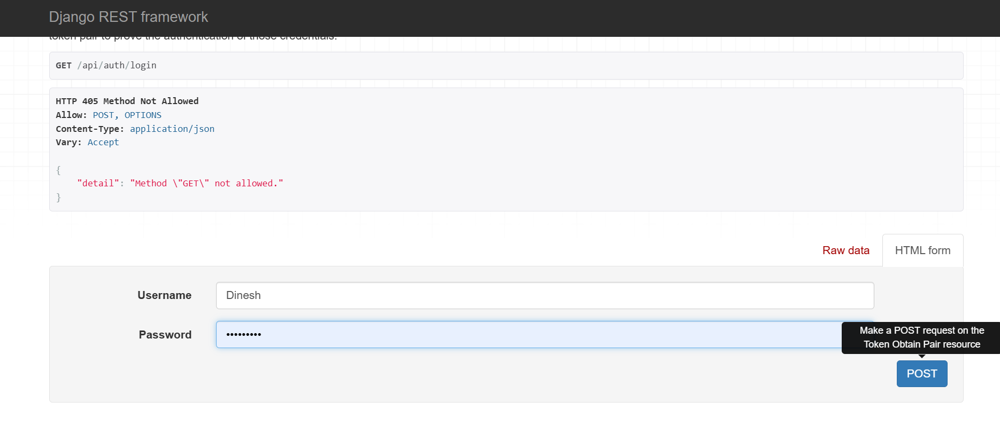
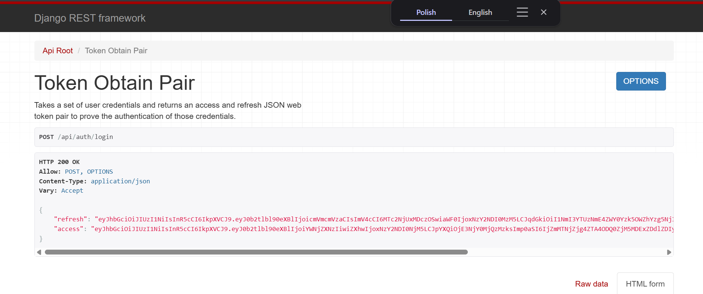
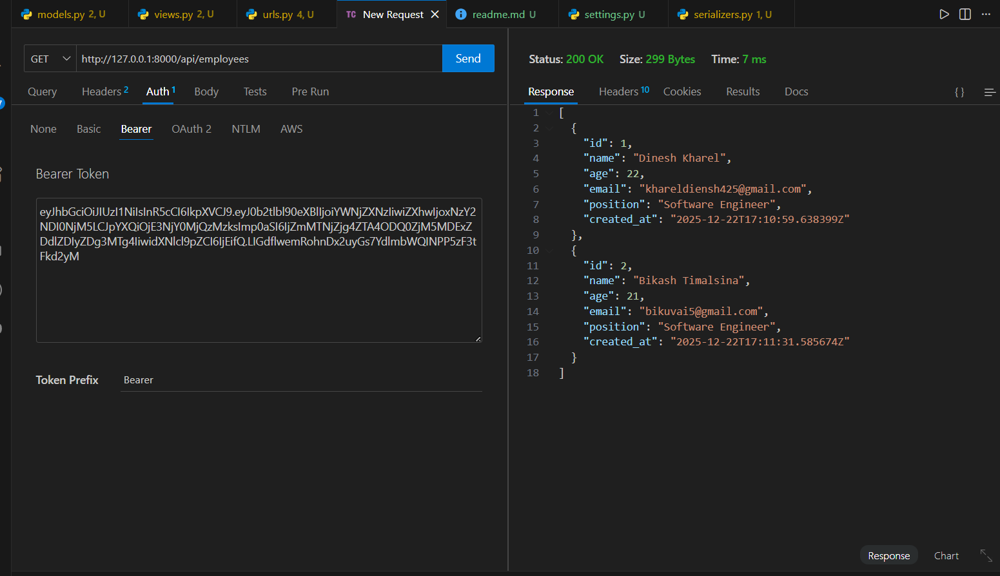
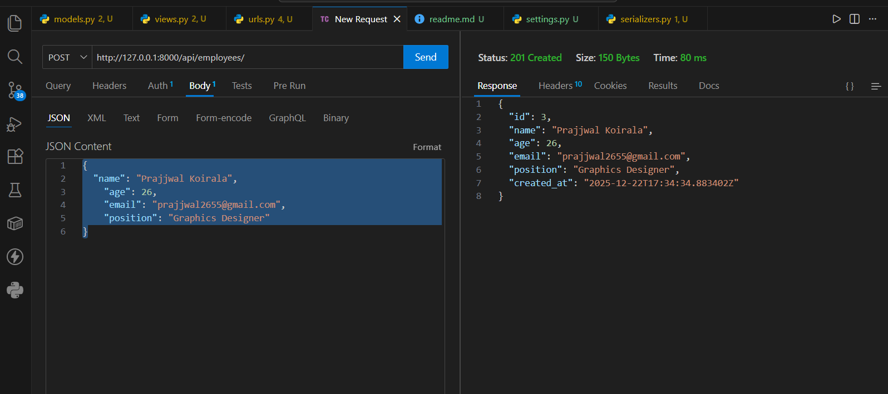
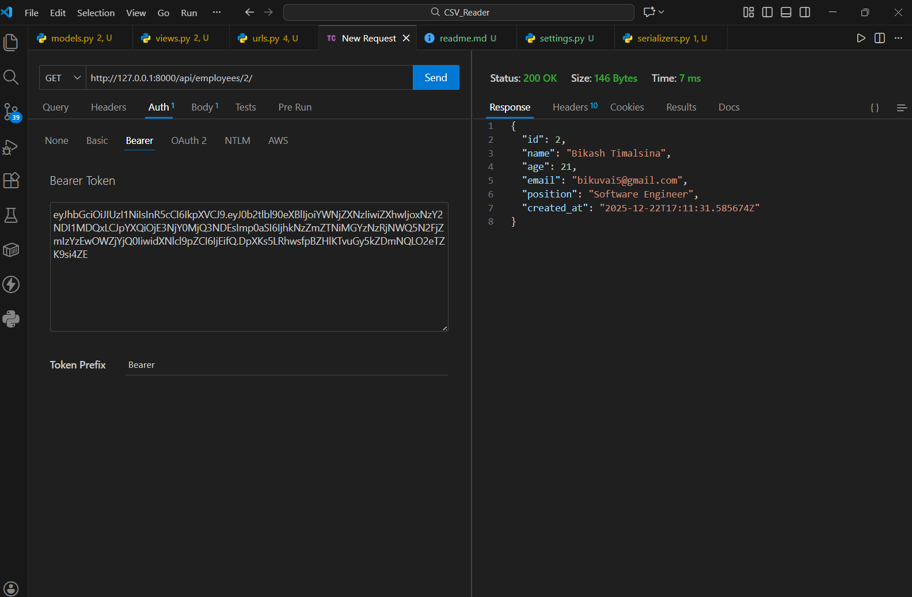
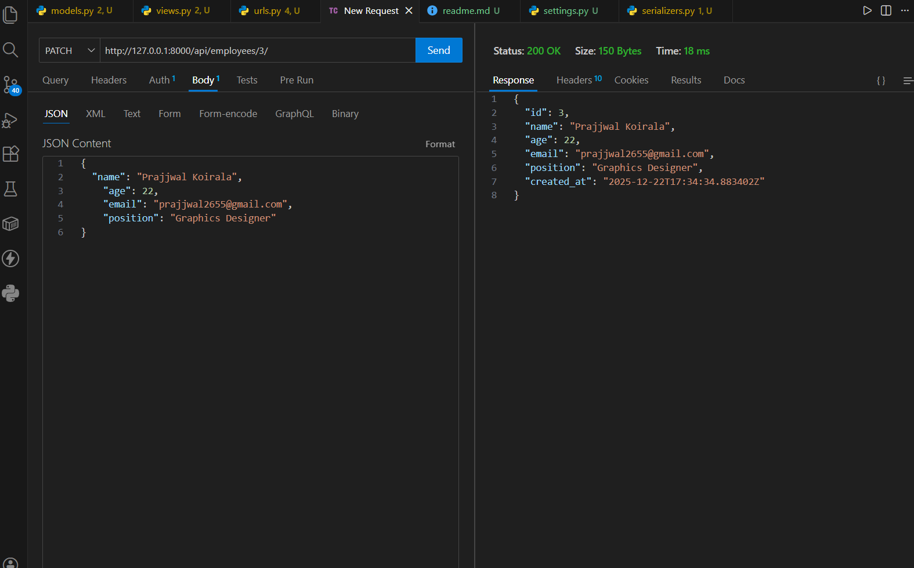
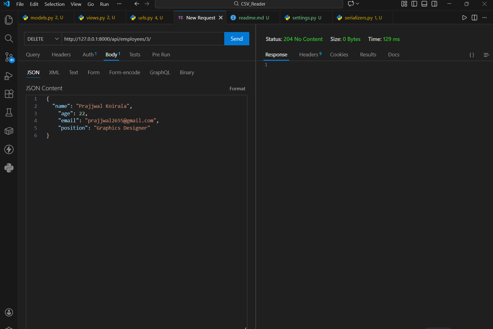
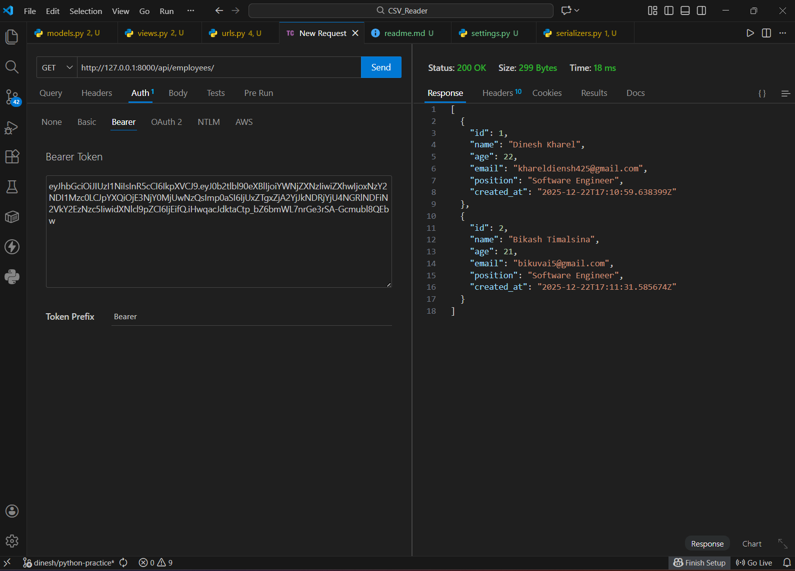

# Employee API with JWT Authentication

This Django REST Framework (DRF) project implements a **secure Employee API** using **JWT authentication** (`djangorestframework-simplejwt`). Only authenticated users can perform CRUD operations on Employee data.

---

## What We Have Implemented

1. **Employee Model**
   - Fields: `name`, `age`, `email`, `position`, `created_at`
   - Age is validated between 18–100
   - Automatically stores creation timestamp (`created_at`)

```python
from django.db import models

class Employee(models.Model):
    name = models.CharField(max_length=20)
    age= models.IntegerField(max_length=100)
    email= models.EmailField()
    position= models.CharField(max_length=40)
    created_at= models.DateTimeField(auto_now_add=True)

```


2. **Serializer**
   - `EmployeeSerializer` maps Employee model fields to JSON for API requests/responses
```python
from rest_framework import serializers
from .models import Employee

class EmployeeSerializer(serializers.ModelSerializer):
    class Meta:
        model = Employee
        fields = '__all__'
```

3. **Views**
   - `EmployeeViewSet` (ModelViewSet) provides all CRUD operations:
     - List all employees
     - Retrieve single employee
     - Create a new employee
     - Update existing employee
     - Delete employee
   - Protected using `IsAuthenticated` → only users with JWT tokens can access


```python
from rest_framework.permissions import IsAuthenticated
from rest_framework.viewsets import ModelViewSet
from .models import Employee
from .serializers import EmployeeSerializer

class EmployeeViewSet(ModelViewSet):
    queryset= Employee.objects.all()
    serializer_class= EmployeeSerializer
    permission_classes= [IsAuthenticated]
```


4. **URLs**
---
### employee_api\urls.py
```python
from rest_framework.routers import DefaultRouter
from .views import EmployeeViewSet

router= DefaultRouter()
router.register(r'employees',EmployeeViewSet,basename='employee')#This will generate urls
urlpatterns = router.urls # By using router.urls the generated urls are stored in urlpatterns

```
---
### authentication_api\urls.py
```python
from django.contrib import admin
from django.urls import path,include
from rest_framework_simplejwt.views import TokenObtainPairView

urlpatterns = [
    path('admin/', admin.site.urls),
    path('api/',include('employee_api.urls')),
    path('api/auth/login',TokenObtainPairView.as_view())
]

```
   - DRF router automatically generates endpoints for Employee CRUD
   - JWT endpoints for authentication:
     - `/api/auth/login/` → get `access` and `refresh` tokens


5. **JWT Authentication**
   - User logs in with username and password
   - Receives **access token** (short-lived) and **refresh token** (long-lived)
   - Access token is sent in the header for all API requests:
     ```
     Authorization: Bearer <access_token>
     ```

---

## How Things Work (Flow)

1. **Login**
   - User sends credentials to `/api/auth/login/`
   - Server validates credentials and returns `access` and `refresh` tokens


   


   

2. **Access Protected Employee API**
   - Include `Authorization: Bearer <access_token>` in headers
   - Perform CRUD operations:
     - GET `/api/employees/` → list employees
       
     - POST `/api/employees/` → create employee
       
     - GET `/api/employees/<id>/` → retrieve employee
       
     - PUT/PATCH `/api/employees/<id>/` → update employee
       
     - DELETE `/api/employees/<id>/` → delete employee
       

       

    


