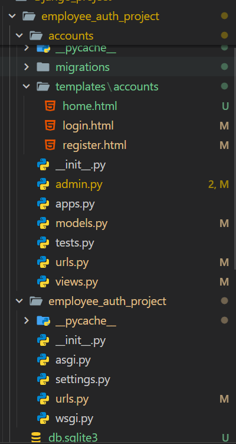
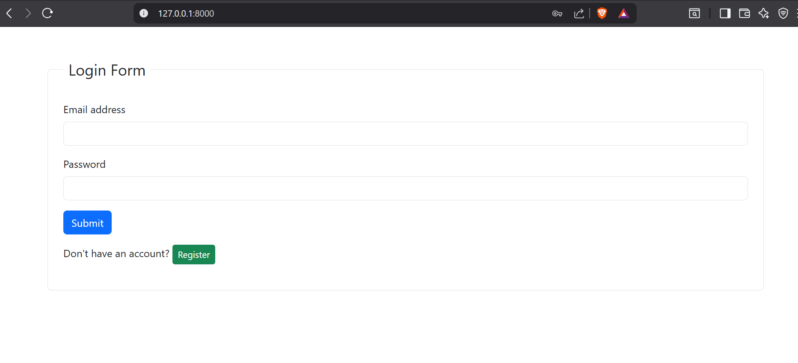
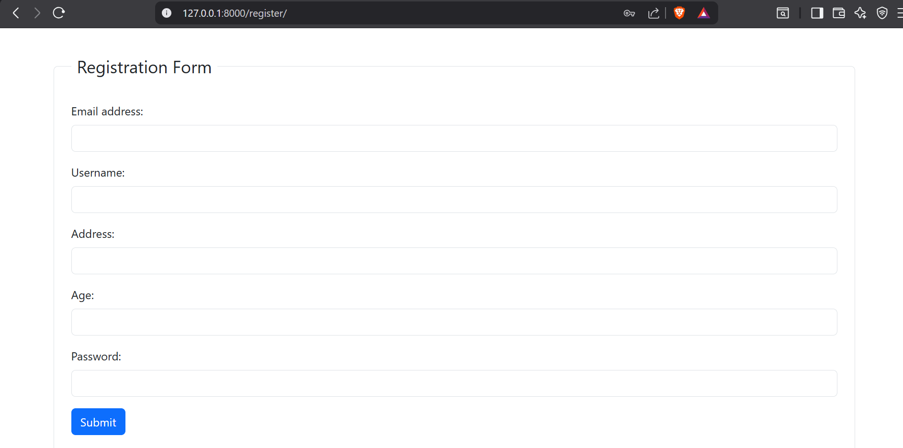
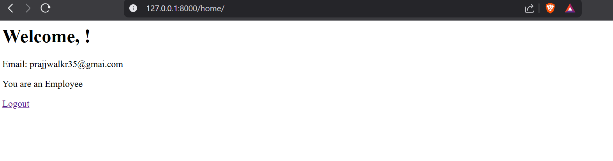
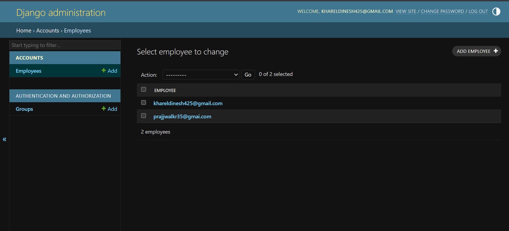

# Employee Authentication System (Django)

This is a simple Employee Authentication System built using Django. The system allows employees to **register**, **login**, and **logout** securely. It also includes a protected home page accessible only to logged-in users.

This project demonstrates how to implement a custom user model in Django, use the authentication framework for login/logout, and handle form validation with user-friendly error and success messages. It’s ideal for small organizations or as a learning project for understanding Django authentication systems.

Key aspects of this project include:

 * Custom Employee model with email as the unique identifier

* Secure password storage using Django’s built-in hashing

* Login-required views to protect sensitive pages

* Feedback messages for better user experience

---

## Project Structure

## Screenshots

# Login page

# Registration page

# After login page

# Admin page after registration

