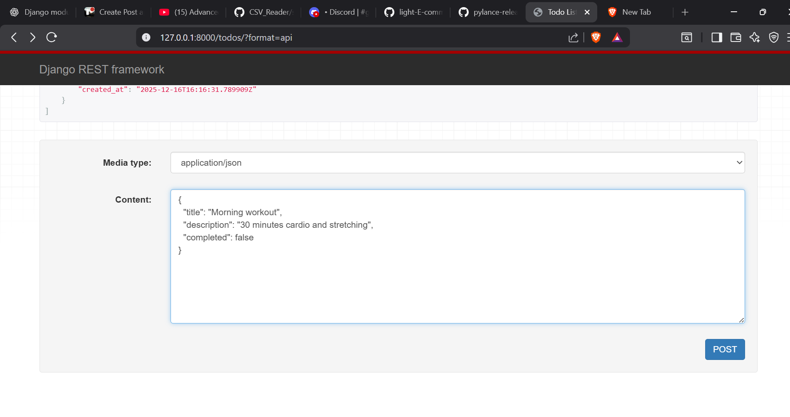
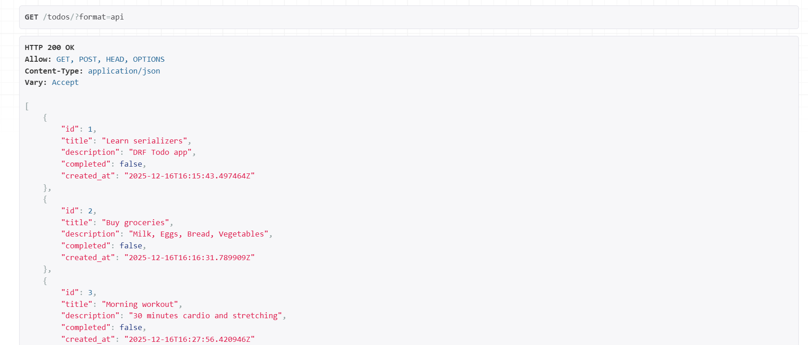

# Django REST Framework Todo API

A simple **Todo application API** built using **Django** and **Django REST Framework (DRF)**.  
Before diving into the app, let's understand the core concepts used in it: **Serializers** and **API Views**.

---

##  Serializers in DRF
 
Serializers in DRF convert complex Django model instances or querysets into **JSON** format, and also validate incoming JSON data for API requests.
 
- Allows your Django models to be exposed via APIs.  
- Handles validation automatically.  
- Converts Python objects to JSON and vice versa.

**How:**  

```python
from rest_framework import serializers
from .models import Todo

class TodoSerializer(serializers.ModelSerializer):
    class Meta:
        model = Todo
        fields = ['id', 'title', 'description', 'completed']
```


##  API Views in DRF

API Views are class-based views that handle HTTP requests (GET, POST, PUT, DELETE) for your API endpoints.

- Simplifies API endpoint creation.
- Provides structured methods for each HTTP verb.
- Integrates directly with serializers for validation and response formatting.


**How:**
```python
from django.shortcuts import render
from rest_framework.views import APIView
from rest_framework.response import Response
from .models import Todo
from .serializers import TodoSerializer

class TodoListCreateAPIView(APIView):

    def get(self,request):
        todos= Todo.objects.all()
        serializer = TodoSerializer(todos,many= True)
        return Response(serializer.data)
    

    def post(self,request):
        serializer= TodoSerializer(data=request.data)
        if serializer.is_valid():
            serializer.save()
            return Response(serializer.data,status= 201)
        return Response(serializer.errors,status=400)
        
```

**Django REST Framework Todo API**

It is  simple Todo application built with Django and DRF that allows users to create, view, and manage todos via JSON-based API endpoints.

**Folder Structure:**

```pgsql
todo_project/
│
├── manage.py
├── core/
│   ├── settings.py
│   ├── urls.py
│   └── views.py
└── todos/
    ├── models.py
    ├── serializers.py
    ├── views.py
    ├── urls.py
    └── admin.py
```
**POST Demo**




**GET Demo**

