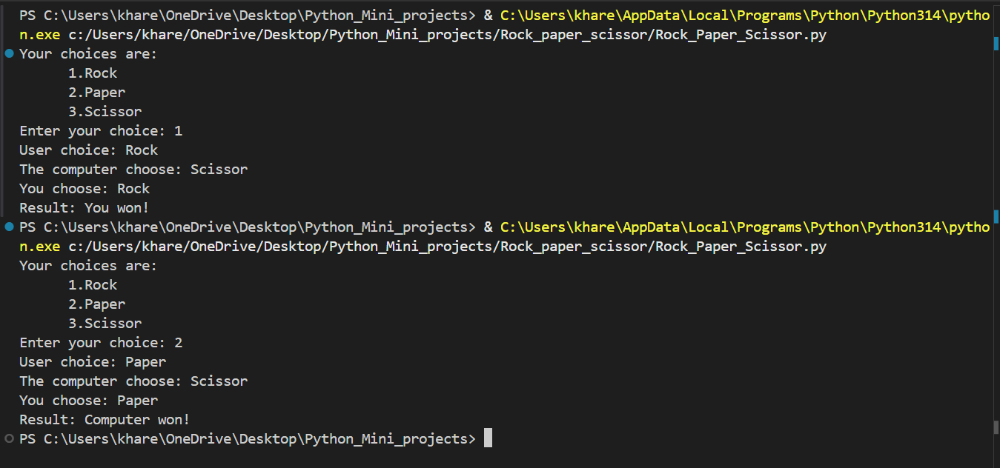

# Rock-Paper-Scissors Game

This is a simple Python implementation of the classic **Rock–Paper–Scissors** game where a human plays against the computer.

---

## **How the Game Works**

* The computer randomly selects either **Rock (0)**, **Paper (1)**, or **Scissor (2)**.
* The user chooses an option from **1 to 3**:

  * `1 → Rock`
  * `2 → Paper`
  * `3 → Scissor`
* The program compares both choices and prints:

  * The computer’s choice
  * The user’s choice
  * The final result (Win / Lose / Draw)

---

##  **Game Logic**

The result is decided using the standard rules:

* **Rock beats Scissor**
* **Paper beats Rock**
* **Scissor beats Paper**
* Same choices → **Draw**

The program checks these conditions using `if`, `elif`, and `else` statements.

---

##  **Code Overview**
``` python
import random
computer_choice={
    0:"Rock",
    1:"Paper",
    2:"Scissor"
}
c_choice=random.randint(0,2)
# print(f"Computer choice: {computer_choice[c_choice]}")
human_choice={
    1:"Rock",
    2:"Paper",
    3:"Scissor"
}
print("""Your choices are:
      1.Rock
      2.Paper
      3.Scissor""")
user_choice=int(input("Enter your choice: "))
# print(f"User choice: {human_choice[user_choice]}")
if(human_choice[user_choice]==computer_choice[c_choice]):
    print(f"The computer choose: {computer_choice[c_choice]}")
    print(f"You choose: {human_choice[user_choice]}")
    print("Result: Draw!")
elif((human_choice[user_choice]== "Rock" and computer_choice[c_choice]=="Scissor")
     or(human_choice[user_choice]=="Paper" and computer_choice[c_choice]=="Rock")
     or(human_choice[user_choice]=="Scissor" and computer_choice[c_choice]=="Paper")):
    print(f"The computer choose: {computer_choice[c_choice]}")
    print(f"You choose: {human_choice[user_choice]}")
    print("Result: You won!")
else:
    print(f"The computer choose: {computer_choice[c_choice]}")
    print(f"You choose: {human_choice[user_choice]}")
    print("Result: Computer won!")
    
```
* A dictionary stores choices for both computer and user.
* The computer selects a random value using:

  ```python
  random.randint(0,2)
  ```
* The user inputs their choice.
* The program compares both choices and prints the outcome.

---

## **How to Run the Game**

1. Make sure you have Python installed.
2. Save the script as `rock_paper_scissor.py`.
3. Run it using:

   ```bash
   python rock_paper_scissor.py
   ```
4. Enter your choice when prompted.

---

##  Output



