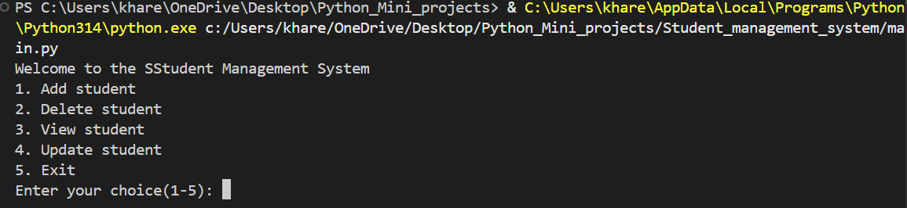
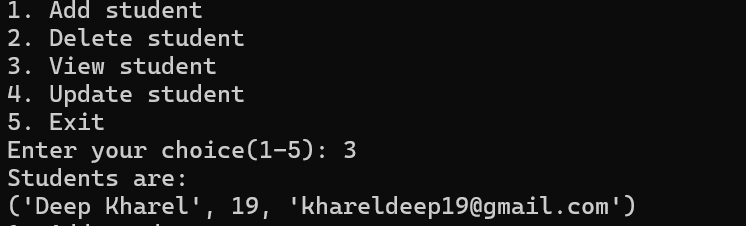
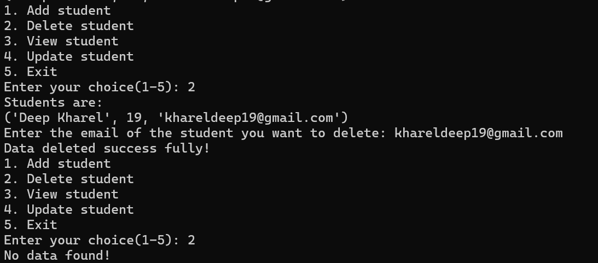
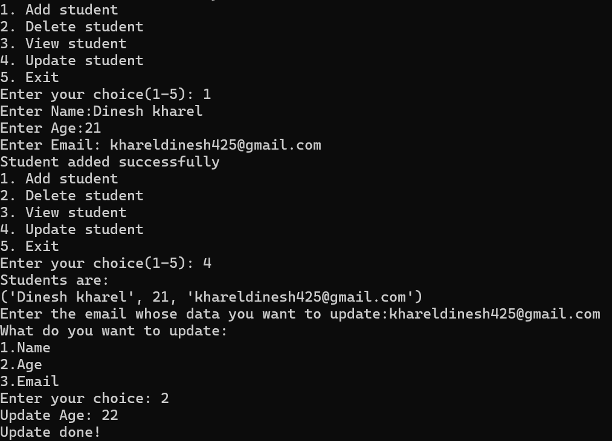
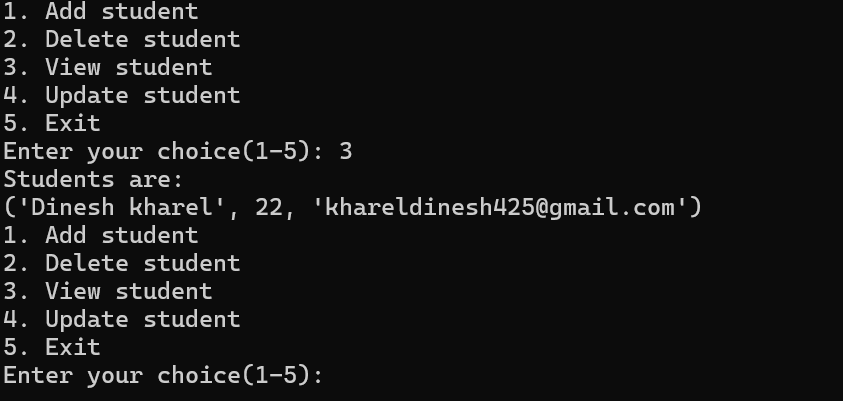

# 📘 Student Management System (SMS)

A simple and modular **Student Management System** written in Python.  
This project runs in the terminal and allows users to **Add, Delete, View, and Update** student records.

The system uses a clean structure with a main controller file and a separate `functions.py` module for all CRUD operations.

---

##  Features

- **Add Student** – Insert new student details  
- **Delete Student** – Remove a student from the system  
- **View Students** – Display all stored students  
- **Update Student** – Modify existing student information  
- **Modular Structure** – Uses `functions.py` for cleaner code  
- **User-friendly CLI Menu**

---

##  Project Structure
``` vbnet
Student_management_system/
|--functions.py
|--main.py
|--readme.md
|--student.py
|--updatefunctionlogic.py
```

## How it works
main.py
- Contains the class StudentManagementSystem

- Displays menu inside a loop



- Calls functions from functions.py

functions.py

``` python
from student import Student
import updatefunctionlogic
import json

filename ="studentdata.json"

def add_student():
    name = input("Enter Name:")
    age= int(input("Enter Age:"))
    email=input("Enter Email: ")
    s = Student(name, age, email)
    s_data ={
        "name":s.name,
        "age":s.age,
        "email":s.email
    }
    try:
        with open(filename,"r") as f:
            data = json.load(f)
    except FileNotFoundError:
        data =[]
    
    data.append(s_data)

    with open(filename,"w") as w:
        json.dump(data,w)

    print("Student added successfully")


def view_student():
    try:
        with open(filename,"r") as r:
            data = json.load(r)
            # print(data)

            if not data:
                print("No data found!")
            else:
               
                print("Students are:")
                for i in range (0,len(data)):
                    # print("  Name  " +" Age "+" Email ")
                    print(f"{data[i]['name'],data[i]['age'],data[i]['email']}")

    except FileNotFoundError:
        print("File not found")


def delete_student():
    view_student()
    del_email= input("Enter the email of the student you want to delete: ")
    try:
        with open(filename,"r") as r:
            data= json.load(r)
            for i in  range(0,len(data)):
                if del_email == data[i]['email']:
                    data.pop(i)
            
        with open(filename,"w") as w:
            json.dump(data,w)

        print("Data deleted success fully!")
    except FileNotFoundError:
        print(" File not found")


def update_student():
            view_student()
            email= input("Enter the email whose data you want to update:")
            print("What do you want to update: ")
            print("""1.Name
2.Age
3.Email""")
            choice = int(input("Enter your choice: "))
            if choice==1:
                updatefunctionlogic.update_studentdata(1,email)
            elif choice==2:
                updatefunctionlogic.update_studentdata(2,email)
            elif choice==3:
                updatefunctionlogic.update_studentdata(3,email)
            else:
                print("Invalid input!")
              
```

upatefunctionlogic.py
```python
filename ="studentdata.json"
import json
def update_studentdata(option,email):
    try:
        with open(filename,"r") as r:
            data = json.load(r)
            for  i in range (len(data)):
                if data[i]['email']==email:
                    if option == 1:
                        u_name= input("Updated Name: ")
                        data[i]['name']=u_name
                    elif option == 2:
                        u_age= int(input("Update Age: "))
                        data[i]['age']=u_age
                    elif option == 3:
                        u_email= input("Updated Email: ")
                        data[i]['email']=u_email
                    else:
                        print("Invalid input!")
        
        with open(filename,"w") as w:
            json.dump(data,w)
        print("Update done!")
    except Exception:
        print(Exception)

```

## Execution
- Add operation


- View operation



- Delete operation



- Update operation

 

  - After update
  
  

