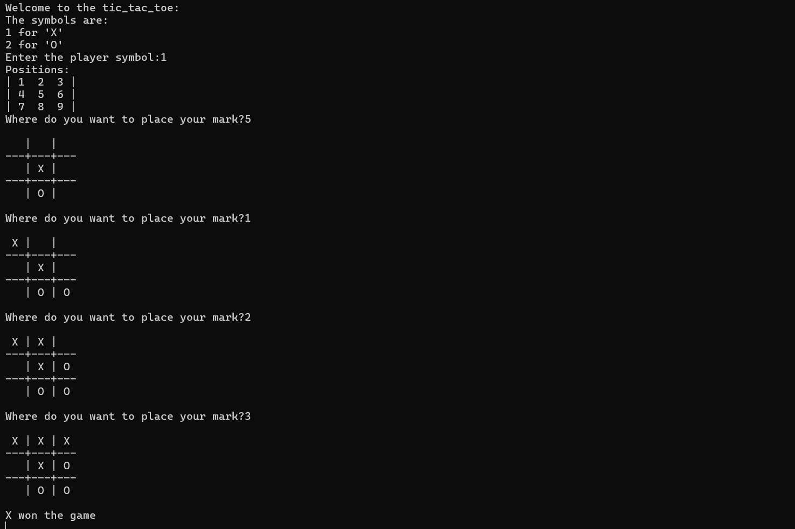

# Tic Tac Toe (Human vs Computer)

This is a Python-based **Tic Tac Toe game** where a human plays against the computer. The computer selects moves randomly, and the game checks for a winner after every turn.

---

## Game Overview

* The game board is a 3×3 grid.
* You choose your symbol:

  * `1 → X`
  * `2 → O`
* The computer automatically takes the opposite symbol.
* You enter positions from **1 to 9** based on this layout:

```
| 1  2  3 |
| 4  5  6 |
| 7  8  9 |
```

Each number corresponds to a cell on the board.

---

## How It Works

### **1. Player chooses a symbol**

You choose whether to play as **X** or **O**, and the computer takes the remaining one.

### **2. Player chooses a move**

* You type a number from 1 to 9.
* The program checks whether the move is valid (not repeated, within range).

### **3. Computer chooses a move**

* The computer randomly selects from the remaining available positions.

### **4. Board updates after each move**

`board.print_board(combo)` is used to print the current game state.
```python
def print_board(combo):
    print(f"""
 {combo[0][0] or ' '} | {combo[0][1] or ' '} | {combo[0][2] or ' '}
---+---+---
 {combo[1][0] or ' '} | {combo[1][1] or ' '} | {combo[1][2] or ' '}
---+---+---
 {combo[2][0] or ' '} | {combo[2][1] or ' '} | {combo[2][2] or ' '}
""")

```

### **5. Win checking**

After each turn, the program calls:

```
winner = winlogic.check_logic(combo)
```
```python
def check_logic(board):
    for row in board:
        if row[0]==row[1]==row[2] != "":
            return row[0]
        
    for col in range(3):
        if(board[0][col]==board[1][col]==board[2][col] !=""):
            return board[0][col]

    if board[0][0]==board[1][1]==board[2][2] !="":
        return board[0][0]    
    
    if board[0][2]==board[1][1]==board[2][0] !="":
        return board[0][2]
    
    return None
```
If a player has three matching symbols in a line, that player wins.

---

## File Dependencies

This script uses two external modules:

* **`board.py`** → Contains a function `print_board()` that displays the board.
* **`winlogic.py`** → Contains `check_logic()` which checks for win conditions.

Ensure these files are in the same directory.

---

## Running the Game

1. Make sure you have Python installed.
2. Create three files in the same folder:

   * `main.py` (your game code)
   * `board.py`
   * `winlogic.py`
3. Run the game using:

```
python main.py
```

---

## Example Gameplay


